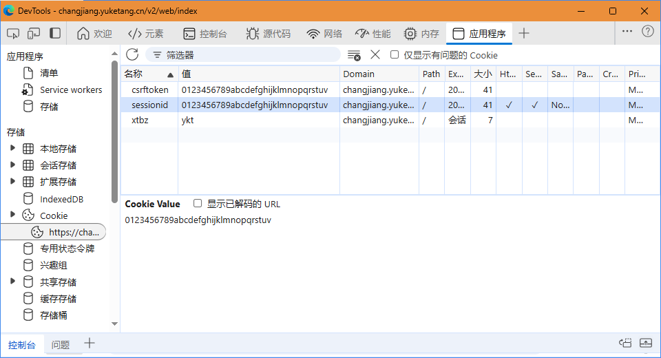

# RainClassroom-Video-Watcher: 雨课堂视频自动观看脚本

## 功能

自动观看雨课堂指定课程的全部视频。

## 使用方法

1. 确保已安装 `Python>=3.10` 和 `HTTPX`，`HTTPX` 可通过 `pip install httpx[http2]` 安装。
1. 下载 [`RainClassroomVideoWatcher.py`](RainClassroomVideoWatcher.py) 至本地；
2. 浏览器访问雨课堂网站并进入需要自动观看视频的课程，  
   网址如 `https://changjiang.yuketang.cn/v2/web/studentLog/12345678`，  
   `authority` 为网址域名即 `changjiang.yuketang.cn`，  
   `classroom_id` 为网址最后的数字如 `12345678`；
3. 打开开发者工具（<kbd>Ctrl</kbd>+<kbd>Shift</kbd>+<kbd>I</kbd>），点击上侧活动栏的『应用程序』，点击展开左侧『Cookies』并点击雨课堂网址，查看 `sessionid`、`csrftoken`、`xtbz`（见下图）；
4. 打开下载至本地的 `RainClassroomVideoWatcher.py`，将使用上述数据填写相关变量；
5. 在终端运行 `RainClassroomVideoWatcher.py`。

## 依赖

* [Python](https://www.python.org/)>=3.10
* [HTTPX](https://www.python-httpx.org/)

<!--
## 参考

|    Date    |  Language  | Repository | Suggested |
|    :--:    |    :--:    |     --     |    :-:    |
| 2024-10-31 |   Python   | <https://github.com/MuWinds/yuketangHelperBUU> | |
| 2024-06-10 | JavaScript | <https://github.com/Dislink/yktVideoHelper> | |
| 2022-07-21 | JavaScript | <https://github.com/CUC-Life-Hack/rainclass-hack> | ✔️ |
| 2021-04-19 |   Python   | <https://github.com/Cat1007/yuketangHelperSCUTLite> | |
| 2020-12-15 |   Python   | <https://github.com/heyblackC/yuketangHelper> | |
-->
